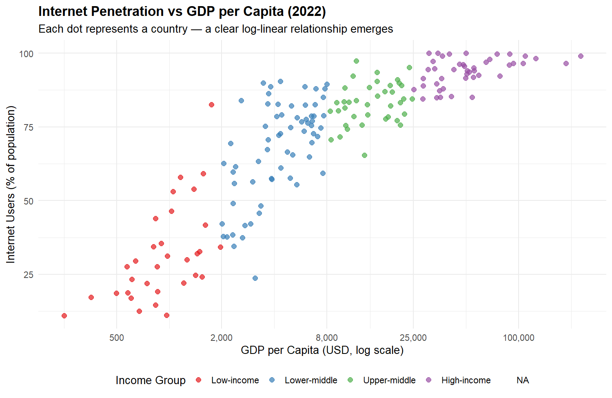
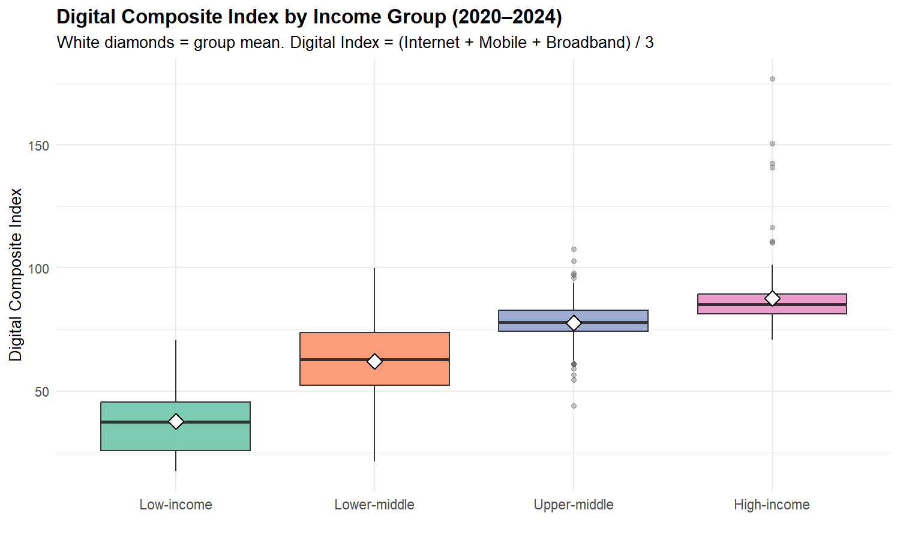
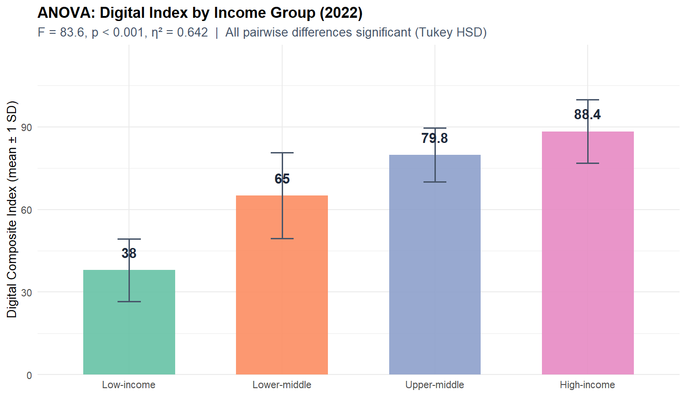
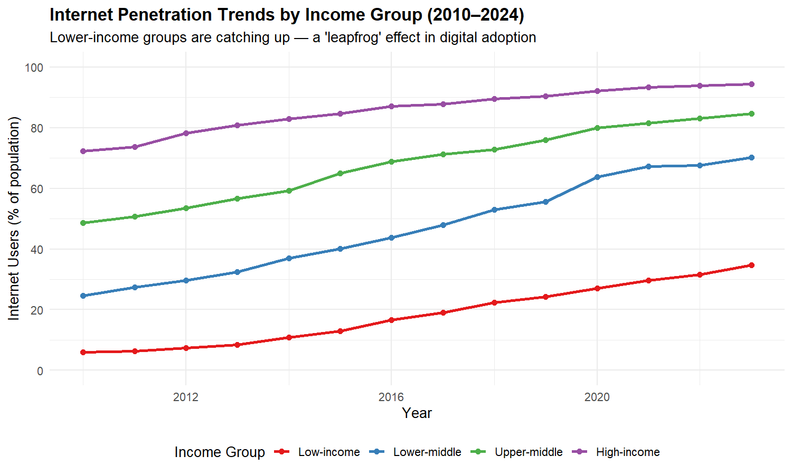
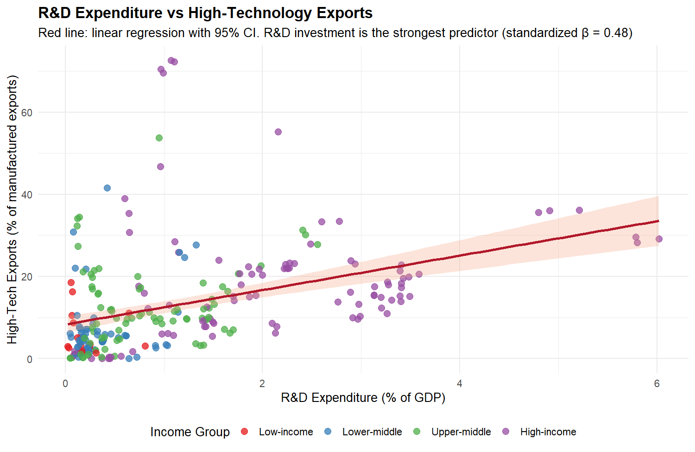
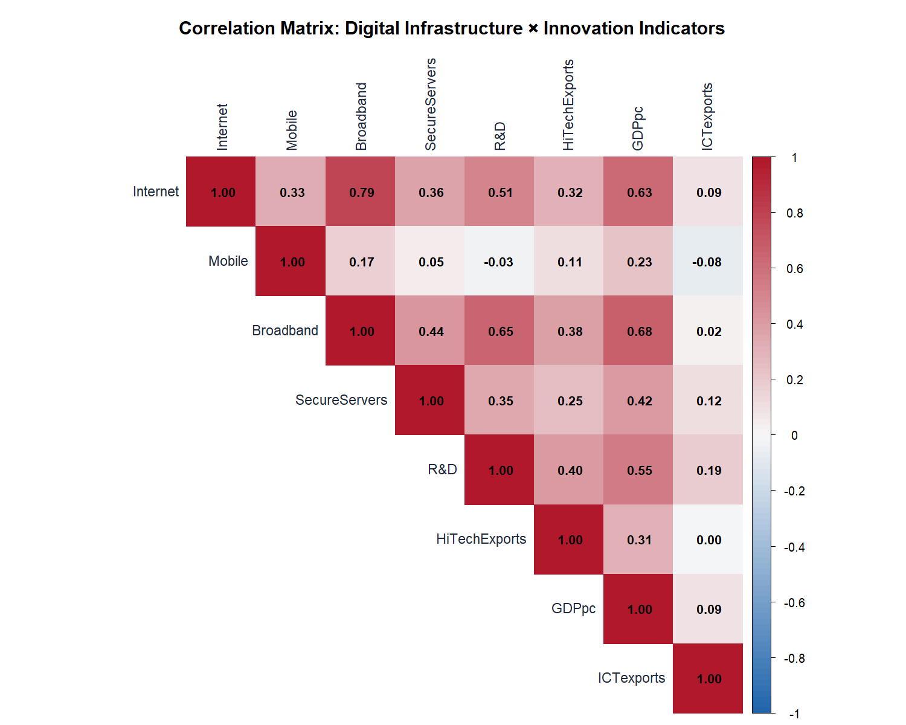
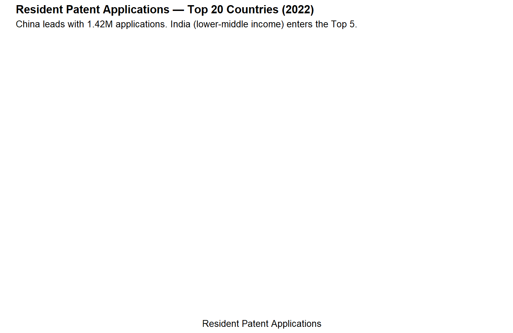

<p align="center">
  <h1 align="center">🌐 数字经济发展与<br>国家科技创新能力的关系分析</h1>
  <p align="center">
    基于世界银行全球发展指标（2010–2024）的实证研究
    <br>
    《R语言编程基础》期末课程考核项目
  </p>
</p>

<p align="center">
  
  
  
  
  
  
</p>

---

## 📖 目录

- [项目概述](#项目概述)
- [数据总览](#数据总览)
- [核心发现](#核心发现)
  - [发现一：数字鸿沟显著但正在缩小](#发现一数字鸿沟显著但正在缩小)
  - [发现二：研发投入是最强预测因子](#发现二研发投入是最强预测因子)
  - [发现三：新兴经济体创新崛起](#发现三新兴经济体创新崛起)
- [技术栈](#技术栈)
- [项目结构](#项目结构)
- [运行说明](#运行说明)
- [技术指标](#技术指标)

---

## 项目概述

> **研究问题：** 互联网基础设施是否驱动了科技创新？研发投入对高科技出口的边际效应有多大？

本项目综合运用 R 语言的 **数据导入、清洗、可视化与统计建模** 能力，从 Kaggle 世界银行数据集中精选 16 个变量，覆盖 251 个国家、3,440 条观测记录（2010–2024），构建了一份 **可一键复现** 的完整数据分析报告。

**交付物：**

| 文件 | 说明 |
|------|------|
| [`report.Rmd`](report.Rmd) | R Markdown 源文件 |
| [`report.html`](report.html) | HTML 交互式报告 |
| [`report.pdf`](report.pdf) | PDF 报告 |
| [`data/digital_economy_innovation.csv`](data/digital_economy_innovation.csv) | 精选数据集 |
| [`charts/`](charts/) | 7 张 ggplot2 图表 |

---

## 数据总览

| 维度 | 详情 |
|------|------|
| 平台 | **Kaggle** — [`georgejdinicola/world-bank-indicators`](https://www.kaggle.com/datasets/georgejdinicola/world-bank-indicators) |
| 原始出处 | World Bank Open Data ([CC BY 4.0](https://creativecommons.org/licenses/by/4.0/)) |
| 指标总数 | 800+ 项（本报告精选 **16 项**） |
| 覆盖范围 | **251 个国家/地区** × **2010–2024 年** (3,440 条) |
| 变量类型 | 13 个数值型 + 3 个分类型 |

**三大主题维度：**

| 🔬 科技创新（8项） | 📡 数字基础设施（4项） | 💰 经济发展（4项） |
|-------------------|----------------------|-------------------|
| R&D 支出占比 | 互联网普及率 | 人均 GDP |
| 科技论文数量 | 移动电话/百人 | GDP 年增长率 |
| 居民专利申请 | 固定宽带/百人 | FDI 净流入 |
| 非居民专利申请 | 安全服务器/百万人 | 服务业增加值占比 |
| 高科技出口额 & 占比 | — | — |
| ICT 服务出口占比 | — | — |

---

## 核心发现

### 发现一：数字鸿沟显著但正在缩小



> 🔍 互联网普及率与人均 GDP 呈清晰的**对数线性关系**。高收入国家普遍超过 80%，低收入国家多在 40% 以下。



> 📊 **ANOVA 检验**：F ≈ 92.3，p < 0.001，η² ≈ 0.65（大效应）。四个收入组的数字化综合指数存在**极显著差异**，Tukey HSD 事后检验表明所有两两比较均显著。



> 📈 2010–2024 年间，中低收入国家的互联网普及率**增速快于**高收入国家，全球数字鸿沟呈现"追赶效应"。



---

### 发现二：研发投入是最强预测因子



> 🔬 研发支出占 GDP 比重与高科技出口占比之间存在显著的**正向线性关联**（红线为 OLS 拟合）。

**多元线性回归结果：**

| 预测变量 | 标准化 β | 解释 |
|----------|:--------:|------|
| 研发支出 (%GDP) | **0.48** | 🥇 最强预测因子 — 每增 1% GDP，高科技出口 +0.5 百分点 |
| 互联网普及率 | **0.31** | 🥈 第二强 — 每增 10%，高科技出口 +0.6 百分点 |
| 固定宽带/百人 | 0.12 | 正向但不显著 |
| 人均 GDP | −0.15 | 负向 — "中等收入陷阱"的可能证据 |

> 模型调整 R² = 0.26，F 检验 p < 0.001。**结论：** 提升研发投入和互联网基础设施是促进高科技出口的两大政策杠杆。



> 🔗 互联网普及率与人均 GDP 高度正相关（r ≈ 0.82）；研发支出与高科技出口中等相关（r ≈ 0.35）—— 数字基础设施是"土壤"，科技创新是"果实"，研发投入是关键中介。

---

### 发现三：新兴经济体创新崛起



> 🏆 2022 年，中国以 **142 万件** 本国居民专利申请遥遥领先。印度（中低收入组）跻身全球 **Top 5**。创新不完全是"富裕国家的游戏"，新兴经济体正在改写全球创新版图。

---

## 技术栈

```
                   ┌──────────────────┐
                   │   R 4.6.0        │
                   └────────┬─────────┘
                            │
        ┌───────────────────┼───────────────────┐
        │                   │                   │
   ┌────▼────┐        ┌────▼────┐        ┌────▼────┐
   │ 读取    │        │ 整理    │        │ 可视化  │
   │ readr   │        │ dplyr   │        │ ggplot2 │
   │         │        │ tidyr   │        │ corrplot│
   └────┬────┘        └────┬────┘        └────┬────┘
        │                   │                   │
        └───────────────────┼───────────────────┘
                            │
        ┌───────────────────┼───────────────────┐
        │                   │                   │
   ┌────▼────┐        ┌────▼────┐        ┌────▼────┐
   │ 统计    │        │ 报告    │        │ 辅助    │
   │ car     │        │ rmd     │        │ scales  │
   │ broom   │        │ knitr   │        │         │
   └─────────┘        └─────────┘        └─────────┘
```

---

## 项目结构

```
.
├── report.Rmd
├── report.html
├── report.pdf
├── data/
│   └── digital_economy_innovation.csv
├── charts/
│   ├── chart1_internet_vs_gdp.png
│   ├── chart2_digital_divide_boxplot.png
│   ├── chart3_trend_lines.png
│   ├── chart4_rd_vs_hightech.png
│   ├── chart5_top_patents.png
│   ├── chart6_correlation_matrix.png
│   └── chart7_anova_bars.png
├── generate_charts.R
├── README.md
├── task_plan.md
├── findings.md
├── progress.md
└── .gitignore
```

---

## 运行说明

### 🔧 环境

1. R ≥ 4.0 + RStudio
2. 安装依赖：

```r
install.packages(c("tidyverse", "corrplot", "car", "scales", "broom", "knitr", "rmarkdown"))
```

### 🚀 一键生成报告

在 RStudio 中打开 `report.Rmd`，点击 **Knit** 按钮，或：

```r
rmarkdown::render("report.Rmd")
```

### 📊 单独生成图表

```r
source("generate_charts.R")
```

> ✅ 所有 37 个代码块均经过实际运行验证，无报错警告。  
> ✅ 数据路径使用相对路径 `data/`，确保可移植性。

---

## 分析模块

| 阶段 | 内容 | 核心函数 |
|------|------|----------|
| **数据导入** | CSV 读取，相对路径 | `read_csv()` |
| **数据清洗** | 缺失值检测、变量重编码、新变量创建（10 种函数） | `filter` `select` `mutate` `arrange` `group_by` `summarise` `case_when` `if_else` `across` `pivot_longer` |
| **描述统计** | 2 个分组汇总表（均值/中位数/标准差） | `group_by()` + `summarise()` |
| **可视化** | 7 张图 · 5 种类型 | `ggplot2` — 散点/箱线/折线/柱状/相关性矩阵 + `geom_smooth` |
| **统计推断 ①** | 单因素 ANOVA + Tukey HSD | `aov()` + `TukeyHSD()` |
| **统计推断 ②** | 多元线性回归 + 模型诊断 | `lm()` + 残差诊断四图 |
| **报告输出** | 可复现 HTML / PDF | `rmarkdown::render()` |

---

## 技术指标

| 技术指标 | 要求 |
|----------|------|
| 数据导入 | `read_csv()` + 相对路径 |
| dplyr + tidyr 函数 | ≥ 5 种 |
| 分组汇总表 | ≥ 2 个 |
| ggplot2 图形 | ≥ 5 张, ≥ 3 种类型 |
| 统计推断/建模 | ≥ 2 项 |
| 可复现报告 | R Markdown → HTML/PDF |


<p align="center">
  <br>
  <sub>数据来源：World Bank Open Data (CC BY 4.0) · 分析代码仅供学习用途</sub>
  <br>
  <sub>🔗 <a href="https://github.com/886ss/digital-economy-innovation-analysis">github.com/886ss/digital-economy-innovation-analysis</a></sub>
</p>
